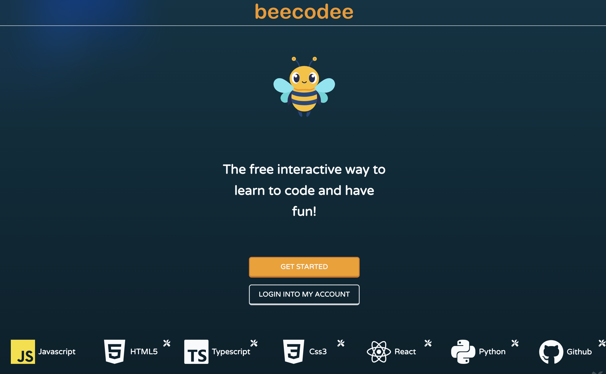
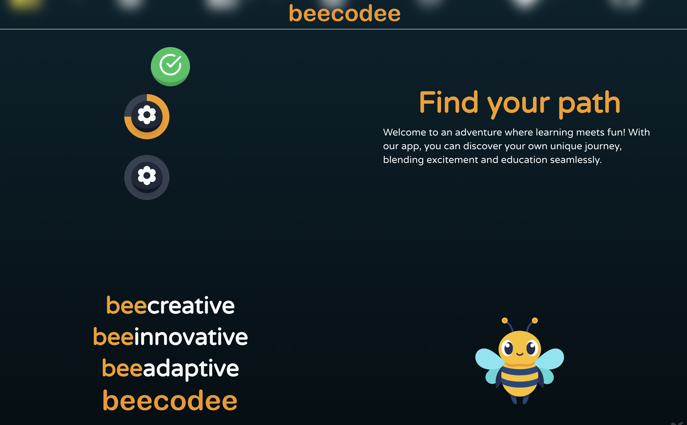

# beecodee
What if we had a Duolingo for learning to code? 

### Presenting beecodee!

## Development List
- [x] Initial Concept
- [x] Home with unit path 🏠
    - [x] Home UI/UX
    - [ ] GetStarted Page
        - [x] GetStarted UI/UX
        - [ ] Enhance questions
        - [ ] Save answers on db
    - [x] Unit Path UI/UX
    - [x] Unit Path Functionality
- [ ] Unit / Lesson / Activity Structure  📒
    - [x] Structure and link between them 
    - [x] Unit Conclusion
    - [ ] Review an Unit
    - [x] Activity Types 
        - [x] Multi completion questions
        - [x] Fill-in-the-blank questions
        - [x] Single choice questions
        - [x] Pair matching questions
        - [ ]  ... ? 
- [ ] Activity Content
    - [ ] JS Course
        - [ ] Syntax
        - [ ] Variables
        - [ ] Operators
        - [ ] Conditionals
        - [ ] Loops
        - [ ] Functions
        - [ ] Arrays
        - [ ] Objects
        - [ ] Classes
        - [ ] ...?
    - [ ] Second course
        - [ ] Data Structure for more courses
- [ ] Points system 💯
    - [x] Data bank connection
    - [x] User Login 
    - [ ] User Points system definition
    - [ ] UI/UX Implementation
- [ ] Small Design Tweaks  🎨
    - [x] Mascot
    - [x] Name
    - [x] Logo
    - [ ] Sounds 🔊
        - [x] Sounds implementation
        - [ ] Find good sounds
    - [ ] Color Scheme
    - [x] Progress Bar
    - [x] Circular progress bar
    - [x] Font
    - [ ] ...?
- [ ] Responsive Design 📱
    - [x] Mobile
    - [ ] Tablet
    - [x] Desktop
- [ ] Deploy 🚀
    - [x] Deployed version on Vercel
    - [ ] SEO 🌐
    - [x] Vercel Analytics
- [ ] Accessibility ♿
    - [ ] Screen Reader
    - [ ] Keyboard Navigation
    - [ ] Color Blindness
    - [ ] ...?
- [ ] Performance ⚡
    - [ ] Lighthouse
    - [ ] Web Vitals
    - [ ] Image Optimization
    - [ ] Code Splitting
    - [ ] ...?
- [ ] Testing 🧪
    - [ ] Unit Testing
    - [ ] Integration Testing
    - [ ] End-to-End Testing
- [ ] Documentation 📚
    - [x] Readme
    - [ ] Code Documentation
    - [ ] User Documentation
- [ ] Community 🌍
    - [x] [TikTok](https://www.tiktok.com/@go_duu)
    - [x] [Twitter](https://x.com/Goduu_)
    - [ ] Instagram
    - [ ] Facebook
    - [ ] LinkedIn
    - [ ] Reddit
    - [ ] ...?    
- [ ] Future Features 🚀
    - [ ] More Courses

## Tech Stack
- Next.js
- React
- Typescript
- MDX
- Tailwind CSS
- Vercel

